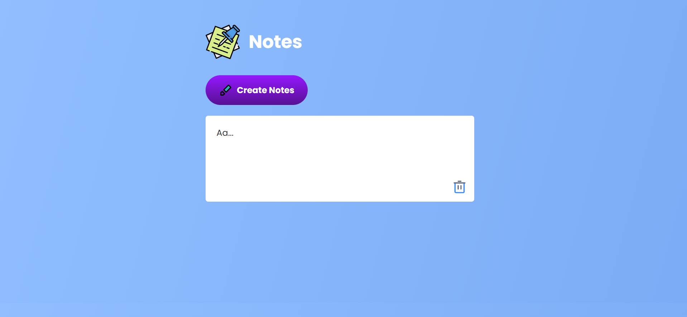

# 📝 Notes App

A simple and interactive **Notes Taking Application** built with **HTML, CSS, and JavaScript**.  
This app allows users to create, edit, and delete notes with persistence using **Local Storage**.

---

## 🚀 Features

- ➕ Create unlimited notes
- 🖊️ Edit notes directly (contenteditable)
- 🗑️ Delete notes with one click
- 💾 Notes are saved automatically in **Local Storage**
- 🎨 Modern and responsive UI with gradient design

---

## 📸 Screenshots



---

## 🛠️ Technologies Used

- **HTML5** – Structure of the app
- **CSS3** – Styling with gradient background and responsive design
- **JavaScript (ES6)** – App logic + LocalStorage for saving notes

---

## ⚙️ Setup Instructions

1. Clone the repository
   ```bash
   git clone https://github.com/your-username/notes-app.git
   ```
2. Navigate to project folder
   ```bash
   cd notes-app
   ```
3. Open index.html in your browser
